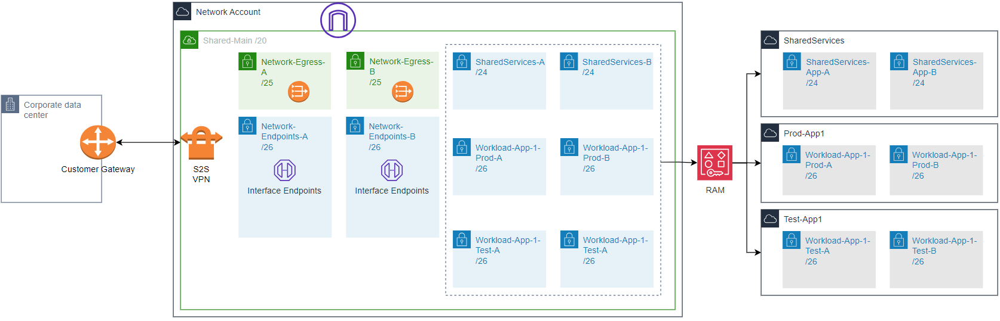

# Landing Zone Accelerator on AWS  - Sample Network Patterns - Flat Network

## Overview
This sample configuration demonstrates how to create a single VPC that can be shared throughout your accounts. This flat network design is simpler than a traditional hub and spoke design. It also designates the Network account as the owner of the entire network so that changes must occur on resources in that account, regardless of which accounts may use the network. This helps enforce who and where changes can be made to the network. As an added benefit, this design does not rely on Transit Gateway, and therefor may reduce network costs by removing that transitive routing requirement. This solution works best for organizations that will not reach the quota's of a single VPC. Be sure to check the [Amazon VPC Quotas](https://docs.aws.amazon.com/vpc/latest/userguide/amazon-vpc-limits.html) page for the most up-to-date limits imposed on a single VPC. 

## Architecture Diagram
In the diagram below, you can see that the VPC and all of its subnets are deployed within the Network Account. Resource Access Manager (RAM) is then used to share specific subnets with specific accounts. For example, the two subnets for Workload-App-1-Prod are shared only with that account. This in effect gives that workload account access to use that subnet. NACLs are configured to segment workloads, but allow each workload to access shared services, network endpoints, and egress. This can all be configured to fit your organizations requirements.

# Configuration Summary
This file serves to provide a general overall summary of the LZA configuration files.

> **_Note_:** LZA administrators are required to review all configuration files and adjust to fit organizational security and compliance needs. This configuration does not inheritly provide full compliance for any framework. Visit the [configuration reference](https://awslabs.github.io/landing-zone-accelerator-on-aws/) to explore available customizations for LZA.

### __Network Configuration__
| Configuration Item | Status | Detail |
| - | - | - |
| Delete Default VPC | Enabled |  |
| Central IPAM | Enabled | /16 Defined for Home Region |
| VPC Endpoint Policies | Defined | Default and EC2 VPC endpoints |
| Provisioned VPCs | Defined | Shared-Main |
| Provisioned Subnets | Defined | Network-Egress-A **(PUBLIC SUBNET)**  Network-Egress-B **(PUBLIC SUBNET)**  Network-Endpoints-A   Network-Endpoints-B   Shared-Services-A   Shared-Services-B   Workload-App-1-Prod-A   Workload-App-1-Prod-B   Workload-App-1-Test-A   Workload-App-1-Test-B |
| Global VPC Flow Logs | Enabled | Delivery to CloudWatch Logs |

In addition, there are these optional configurations. Uncomment the appropriate sections to utilize these network features.
| Configuration Item | Status | Detail |
| - | - | - |
| S2S VPN | Defined | Update with your customer gateway information |

### __Accounts Configuration__
This sample has minimal dependency on this config file. It only defines the additional example application accounts for demonstrative purposes.
|  Configuration Item | Status | Detail |
| - | - | - |
| Workload AWS Accounts | Defined | SharedServices   Network   App-1-Test   App-1-Prod |

### __Organization Configuration__
This sample has minimal dependency on this config file. It only adds the additional OUs for demonstrative purposes.
| Configuration Item | Status | Detail 
| - | - | - |
| OUs | Defined | Workload   Workload/Test   Workload/Prod |

# For further consideration
This is a baseline for Landing Zone Accelerate which demonstrates how to deploy a single shared VPC. It is a _starting point_ for you to use, as you align your organization objectives and tailor to your specific business requirements. AWS provides resources for you to consult with, as you begin customizing your deployment of LZA:

1. Refer to the [Best Practices](https://aws.amazon.com/blogs/mt/best-practices-for-organizational-units-with-aws-organizations/) for Organizational Units with AWS Organizations blog post for an overview.
1. [Recommended OUs and accounts](https://docs.aws.amazon.com/whitepapers/latest/organizing-your-aws-environment/recommended-ous-and-accounts.html). This section of the `Organizing your AWS Environment Using Multiple` Accounts Whitepaper discusses the deployment of specific-purpose OUs in addition to the foundational ones established by the LZA. For example, you may wish to establish a `Sandbox` OU for experimentation, a `Policy Staging` OU to safely test policy changes before deploying them more broadly, or a `Suspended` OU to hold, constrain, and eventually retire accounts that you no longer need.
1. [AWS Security Reference Architecture (SRA)](https://docs.aws.amazon.com/prescriptive-guidance/latest/security-reference-architecture/welcome.html). The SRA "is a holistic set of guidelines for deploying the full complement of AWS security services in a multi-account environment." This document helps you to explore the "big picture" of AWS security and security-related services in order to determine the architectures most suited to your organization's unique security requirements.
1. LZA on AWS [Implementation Guide](https://docs.aws.amazon.com/solutions/latest/landing-zone-accelerator-on-aws/solution-overview.html). This is the official documentation of the Landing Zone Accelerator Project and serves as your starting point. Use the instructions in the implementation guide to stand up your environment.
1. AWS Labs [LZA Accelerator](https://github.com/awslabs/landing-zone-accelerator-on-aws) GitHub Repository. This is the official codebase of the Landing Zone Accelerator Project.